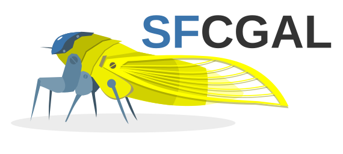

# PySFCGAL - Documentation

**Description:** An official wrapper around the SFCGAL library for Python in the style of Shapely.

**Author and contributors:** Loïc Bartoletti,Raphaël Delhome, Jean Felder, Florent Fougères

**Initial work** : This project is a fork of the [project](https://github.com/snorfalorpagus/pysfcgal/) created by [Joshua Arnott](https://github.com/snorfalorpagus).

**Sponsored by** : [OSLANDIA](https://www.oslandia.com)

**Version:** 1.5.2

**Source code:** [http://www.sfcgal.org/](http://www.sfcgal.org/)

**Powered by [SFCGAL Contributors](https://sfcgal.gitlab.io/SFCGAL/)**
